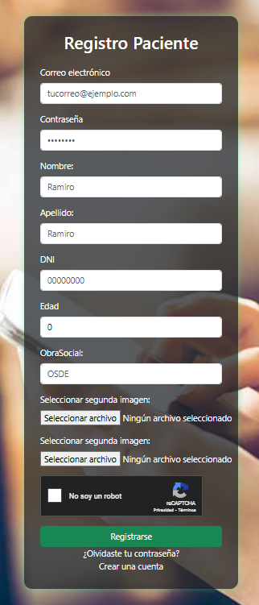
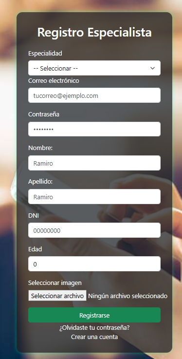

# Clinica Online

## Descripcion general 
Proyecto que representa un portal de turnos medicos digitl.
# Deploy: 

[Clinica Online](https://fernando-malinowski-clinica-online-2025-fmalinowskis-projects.vercel.app/home
)

### pagina de Bienvenida
Posee accesos directos a las secciones:
-**login**: inicio de sesion.
-**registro**: crear cuenta.
-**solicitar turno**: si esta logueado solicita turno o en caso contrario redirige al login.


### Registro
Le pregunta al usuario si quere registrarse como:
-**paciente**: debe completar un captcha y cargar dos imagenes.
-**especialista**: tiene que cargar al menos una especialidad.




### Login
En esta seccion permite al usuario registrarse. Tambien hay un boton de acceso rapido.


### LoMi perfil


### Seccion Usuarios
Seccion disponible solo para usuarios de perfil administrador: 
-**Lista de usuarios**: se peuden ver todos los usuarios con sus datos y tambien se puede habilitar o deshabilitar usuarios especialista.
-**Registrar paciente**: permite dar de alta un paciente.
-**Registrar Especialista**: permite dar de alta un especialista.
-**Registrar admin**: permite dar de alta un administrador.
-**datos de usuarios**: permite descargar un excel con los datos de los usuarios.


This project was generated using [Angular CLI](https://github.com/angular/angular-cli) version 20.0.1.

## Development server

To start a local development server, run:

```bash
ng serve
```

Once the server is running, open your browser and navigate to `http://localhost:4200/`. The application will automatically reload whenever you modify any of the source files.

## Code scaffolding

Angular CLI includes powerful code scaffolding tools. To generate a new component, run:

```bash
ng generate component component-name
```

For a complete list of available schematics (such as `components`, `directives`, or `pipes`), run:

```bash
ng generate --help
```

## Building

To build the project run:

```bash
ng build
```

This will compile your project and store the build artifacts in the `dist/` directory. By default, the production build optimizes your application for performance and speed.

## Running unit tests

To execute unit tests with the [Karma](https://karma-runner.github.io) test runner, use the following command:

```bash
ng test
```

## Running end-to-end tests

For end-to-end (e2e) testing, run:

```bash
ng e2e
```

Angular CLI does not come with an end-to-end testing framework by default. You can choose one that suits your needs.

## Additional Resources

For more information on using the Angular CLI, including detailed command references, visit the [Angular CLI Overview and Command Reference](https://angular.dev/tools/cli) page.
